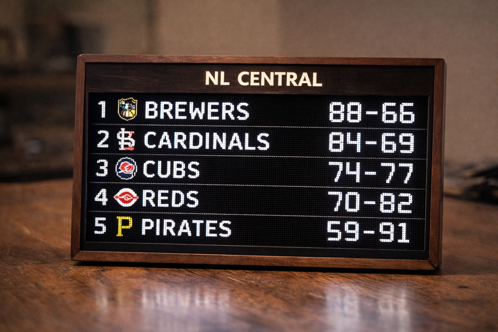

# MLB LED Sign

A Raspberry Pi–powered LED matrix sign that displays MLB standings (division rank and wins/losses), updating automatically from an API.

This repository acts as both the project codebase and a build log, so the setup can be reproduced later (including building a second unit).



---

## Project Overview

The goal of this project is to build a clean, scoreboard-style LED sign with a physical, finished feel (wood enclosure planned). The initial version is a desk-scale prototype that can later scale into a larger wall or garage display.

**Key goals:**

- Display MLB standings grouped by division
- Show division rank and W–L record
- White text on black background (classic scoreboard look)
- Automatic daily updates from an API
- Optional rotation between divisions
- Optional scheduled on/off times
- Reproducible build for additional units

---

## Hardware Summary

**Core hardware for the prototype:**

- Raspberry Pi Zero 2 W
- Adafruit RGB Matrix Bonnet
- Adafruit 64×32 RGB LED Matrix (5mm pitch, HUB75)
- HUB75 ribbon cable
- USB-C PD wall charger
- USB-C → 5.5mm barrel power cable

> **Important power note:** The LED matrix is powered through the RGB Matrix Bonnet, which also powers the Raspberry Pi. The Pi must **NOT** be powered via micro-USB when the matrix is attached.

---

## Software Summary

- Raspberry Pi OS (64-bit)
- Headless configuration (no monitor or keyboard)
- SSH access enabled
- Python 3 with project dependencies isolated in a virtual environment

---

## Documentation

Detailed setup and hardware notes are kept out of this README and live in the `docs/` directory:

### [`docs/SETUP.md`](docs/SETUP.md)

- OS installation
- SSH and network configuration
- System updates
- Python virtual environment setup

### [`docs/HARDWARE.md`](docs/HARDWARE.md)

- Physical wiring
- Power architecture
- Hardware bring-up checklist
- Important gotchas

---

## Current Status

- [x] Raspberry Pi OS installed and updated
- [x] SSH access verified
- [x] Hardware documented
- [x] LED matrix wired and tested (sign turns on)
- [x] TypeScript codebase: API client, renderer, config, caching
- [x] LED matrix hardware integration (`rpi-led-matrix`)
- [ ] First live render on the sign
- [ ] Systemd service for auto-start on boot

---

## Deployment

From your local machine:

```bash
./scripts/deploy.sh mrandyclark@mlb-sign.local
```

This installs Node.js, clones the repo, builds, and prints run instructions.

To run manually on the Pi:

```bash
sudo node dist/index.js
```

To install as a boot service:

```bash
sudo cp scripts/mlb-sign.service /etc/systemd/system/
sudo systemctl daemon-reload
sudo systemctl enable mlb-sign
sudo systemctl start mlb-sign
```

## Planned Next Steps

- [ ] First live render on the sign
- [ ] Systemd auto-start on boot
- [ ] Tune brightness and GPIO slowdown
- [ ] Add rotation and scheduling logic
- [ ] Enclosure build

---

## Notes

This project intentionally prioritizes clarity and repeatability over cleverness. All non-obvious setup steps are documented so future builds can follow the same path without re-discovering details.
